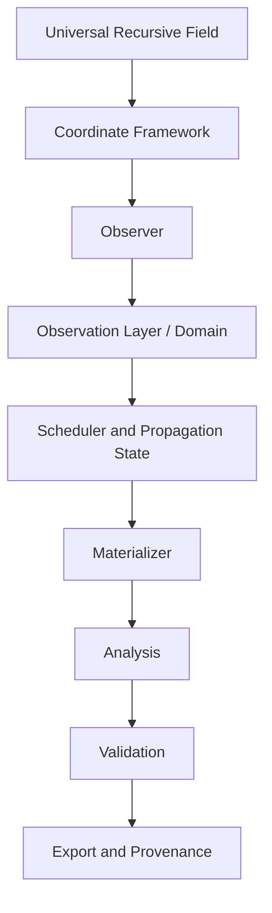
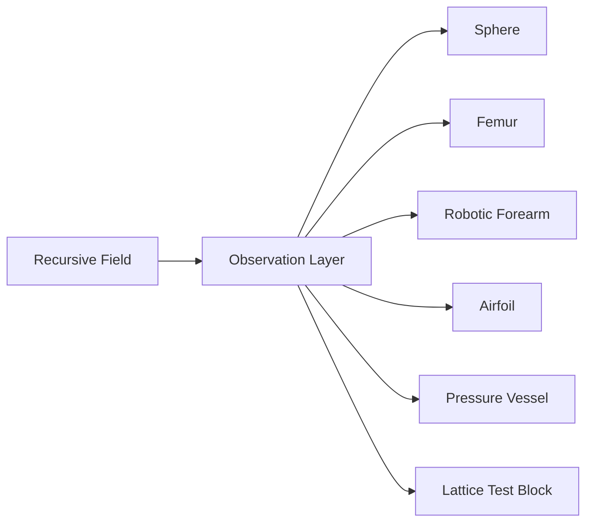
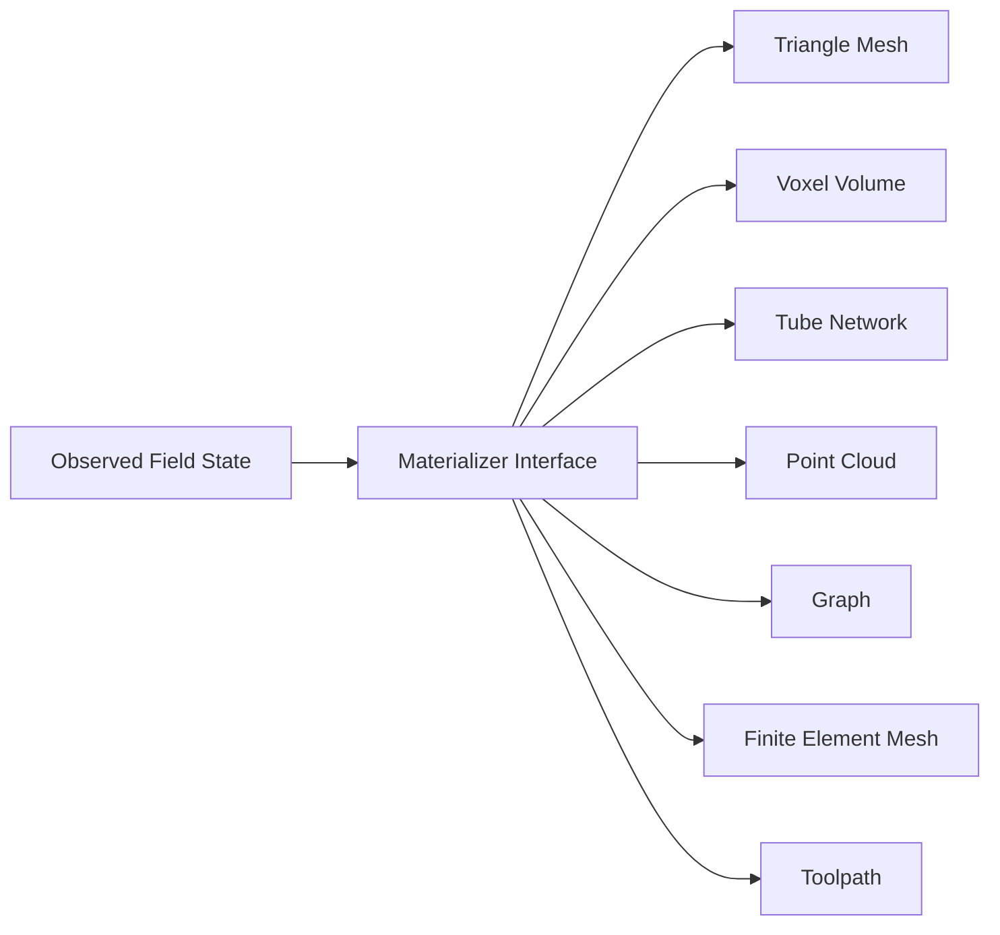
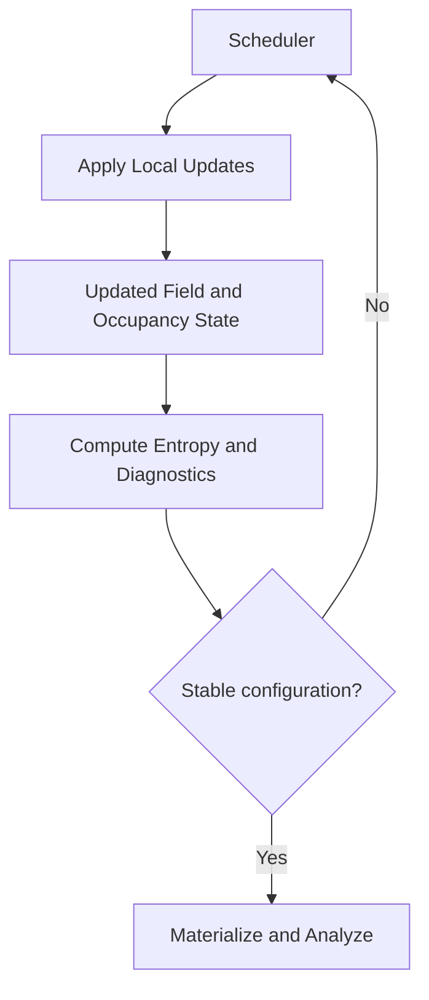
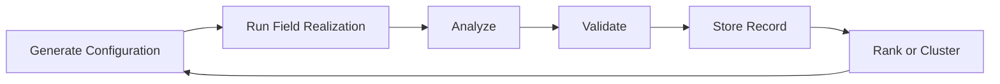

# Surface Foundry DCRTE-ET Architecture Specification

## Domain-Constrained Recursive Topology Engine with Emergent Entropic Scheduling

**Version:** 0.3  
**Status:** Proposed experimental architecture  
**Primary integration target:** Processing 4 / Cosmosis Visual Observatory / Surface Foundry  
**Repository:** `FieldworksMindlab/Cosmosis_RDFT_Suite`  
**Author and project lead:** Brian Fahey / Fieldworks Mindlab  
**Document purpose:** Canonical implementation guide for Codex and future contributors

---

> **Fields are primary. Geometry is emergent.**

> **Surface Foundry is an implicit recursive field laboratory for exploring how constrained recursive processes generate statistically organized material structures. Domains act as observation constraints rather than deformation targets, while modular schedulers, coordinate systems, and analysis pipelines enable quantitative investigation of topology, geometry, and emergent organization across arbitrary volumetric forms.**

---

## Table of Contents

1. [Executive Summary](#1-executive-summary)
2. [Research Status and Scientific Boundaries](#2-research-status-and-scientific-boundaries)
3. [Relationship to the Existing Cosmosis RDFT Suite](#3-relationship-to-the-existing-cosmosis-rdft-suite)
4. [Design Principles](#4-design-principles)
5. [Terminology](#5-terminology)
6. [Conceptual Model](#6-conceptual-model)
7. [System Architecture](#7-system-architecture)
8. [Canonical Data Flow](#8-canonical-data-flow)
9. [Core Data Structures](#9-core-data-structures)
10. [Field Engine](#10-field-engine)
11. [Domain Import and Repair](#11-domain-import-and-repair)
12. [Signed Distance Field System](#12-signed-distance-field-system)
13. [Observation Layer](#13-observation-layer)
14. [Observer and Sampling System](#14-observer-and-sampling-system)
15. [Coordinate Framework](#15-coordinate-framework)
16. [Intrinsic Coordinates](#16-intrinsic-coordinates)
17. [Constraint and Boundary Framework](#17-constraint-and-boundary-framework)
18. [Scheduler Framework](#18-scheduler-framework)
19. [Emergent Entropic Scheduler](#19-emergent-entropic-scheduler)
20. [Entropy Models](#20-entropy-models)
21. [Propagation Engine](#21-propagation-engine)
22. [Density and Orientation Fields](#22-density-and-orientation-fields)
23. [Materialization Framework](#23-materialization-framework)
24. [Analysis Framework](#24-analysis-framework)
25. [Hyperuniformity Analysis](#25-hyperuniformity-analysis)
26. [Topology and Persistent Structure](#26-topology-and-persistent-structure)
27. [Validation Framework](#27-validation-framework)
28. [Parameter Space Explorer](#28-parameter-space-explorer)
29. [Visualization and User Interface](#29-visualization-and-user-interface)
30. [Configuration and Provenance](#30-configuration-and-provenance)
31. [Processing Integration Strategy](#31-processing-integration-strategy)
32. [Recommended Repository Structure](#32-recommended-repository-structure)
33. [Performance and Memory Requirements](#33-performance-and-memory-requirements)
34. [Testing Strategy](#34-testing-strategy)
35. [Implementation Roadmap](#35-implementation-roadmap)
36. [Codex Execution Instructions](#36-codex-execution-instructions)
37. [Acceptance Criteria](#37-acceptance-criteria)
38. [Future Research Modules](#38-future-research-modules)
39. [Risks and Guardrails](#39-risks-and-guardrails)
40. [References](#40-references)
41. [Appendix A: Java-Style Interfaces](#appendix-a-java-style-interfaces)
42. [Appendix B: Example Configuration](#appendix-b-example-configuration)
43. [Appendix C: Example Analysis Output](#appendix-c-example-analysis-output)
44. [Appendix D: First Codex Work Order](#appendix-d-first-codex-work-order)

---

# 1. Executive Summary

DCRTE-ET extends Surface Foundry from a generator of spheroidal and carrier-wrapped meshes into a general domain-constrained implicit field research platform.

The existing Surface Foundry workflow already samples a recursive topology scalar into a three-dimensional volume, extracts a printable shell, records parameters, and creates STL and drafting artifacts. DCRTE-ET preserves that working foundation while adding a modular architecture for arbitrary closed domains, intrinsic coordinates, event-driven propagation, quantitative analysis, and automatic validation.

The system shall not deform a completed recursive object into the shape of a femur, robotic limb, bracket, shell, or other target. Instead, it shall evaluate the recursive field within an imported volumetric domain. The domain acts as an observation constraint. Material geometry emerges from the interaction among:

- the recursive field;
- the observation domain;
- the coordinate system;
- the scheduler;
- local density and orientation controls;
- the materialization rule;
- validation and analysis constraints.

The architecture is designed around interchangeable interfaces. A field does not know what object is being generated. A scheduler does not directly define geometry. A materializer does not own the field. An analyzer does not modify the result. This separation allows the same underlying field to be observed through a sphere, femur, airfoil, robotic forearm, pressure vessel, lattice block, or any other valid volumetric domain.

The first implementation shall remain compatible with Processing 4 and the current `Cosmosis_Visual_Observatory.pde` workflow. It shall be introduced incrementally behind feature flags and must not break the legacy Surface Foundry output path.

The first practical research target is a closed imported shell that can be voxelized, converted to a signed distance field, filled by a recursive field, observed through Cartesian or basic intrinsic coordinates, propagated with either an immediate scheduler or an Emergent Entropic Scheduler, materialized into a mesh, analyzed, validated, and exported with reproducible metadata.

---

# 2. Research Status and Scientific Boundaries

DCRTE-ET is an experimental computational research module. It is intended to test ideas, not encode conclusions.

The framework investigates whether recursive field organizations can preserve measurable statistical or topological characteristics when evaluated within different finite domains. Terms such as "invariance," "emergence," "entropic scheduling," "hyperuniformity," and "stable recursive field configuration" are research targets that require operational definitions and measured evidence.

The following boundaries are mandatory:

1. **Do not claim topological invariance from visual resemblance.** Invariance must be evaluated using explicit metrics such as connected components, Euler characteristic, Betti numbers, persistence diagrams, spectral descriptors, or other documented tests.
2. **Do not equate a computational entropy heuristic with physical thermodynamic entropy.** Every entropy model must identify the sampled state, probability distribution, neighborhood, units, and normalization.
3. **Do not state that the software operates without physical time.** The computer still executes instructions using processor timing. "Emergent entropic scheduling" means that simulated state ordering is determined by internal observables rather than a fixed simulation timestep.
4. **Do not state that an entropic scheduler reproduces the Barontini experiment.** The experiment motivates relational ordering. The software module is a computational analogy and must remain labeled as such.
5. **Do not label a generated structure as a medical implant, bone replacement, or validated prosthetic component.** Biological and mechanical uses are future application areas requiring extensive material, safety, regulatory, and clinical validation.
6. **Do not let analysis modules confirm predetermined conclusions.** They must report measurements, assumptions, uncertainty, and failure states.

Preferred language:

- "hyperuniform candidate" rather than "hyperuniform" unless finite-size and convergence tests pass;
- "stable recursive field configuration" rather than "topological attractor" unless an attractor is formally established;
- "domain-constrained field realization" rather than "preserved invariant object";
- "bio-inspired scaffold geometry" rather than "bone scaffold" when no biological validation exists;
- "emergent entropic scheduler" rather than "entropic clock" in software interfaces.

---

# 3. Relationship to the Existing Cosmosis RDFT Suite

The Cosmosis RDFT Suite is currently organized as a monorepo containing independent but related Processing, SuperCollider, Python, shell, and optional TouchDesigner instruments. Surface Foundry lives in the visual-only Cosmosis Visual Observatory and currently converts the live topology field into printable geometry, STL metadata, call sheets, and relief artifacts.

The existing Surface Foundry implementation provides several important assets that DCRTE-ET must preserve:

- a shared recursive field state;
- the existing `topologyScalar(...)` evaluation path;
- material profile adapters;
- geometry carriers such as TPMS blends, gyroid, Schwarz P, Beltrami saddle, Hopf torus, petaminx lattice, Mandelbrot, Julia, and fractal ridge;
- voxel-band shell extraction;
- optional transport-vein geometry;
- STL and JSON export;
- deterministic call-sheet generation;
- strict black-and-white and tonal drafting modes;
- existing keyboard and panel controls.

DCRTE-ET is therefore an extension and refactor, not a replacement.

The current direct path can be summarized as:

```text
shared RDFT controls
    -> topologyScalar(x, y, z)
    -> sampled 3D volume
    -> voxel-band mesh extraction
    -> STL / JSON / call sheet
```

The DCRTE-ET path becomes:

```text
shared RDFT controls
    -> FieldEngine
    -> CoordinateSystem
    -> Observer
    -> ObservationDomain
    -> ConstraintSystem
    -> Scheduler / PropagationState
    -> Materializer
    -> Analysis
    -> Validation
    -> STL / volume / graph / JSON / call sheet
```

The legacy workflow shall remain available as a `LEGACY_DIRECT` pipeline until the modular path achieves output parity.

---

# 4. Design Principles

## Principle I: Fields are primary. Geometry is emergent.

Geometry is not the starting object. Geometry is one material representation of an underlying scalar, vector, tensor, or recursive state field.

```text
Recursive Field
    -> Statistical Structure
    -> Threshold or Material Rule
    -> Topology
    -> Material Representation
    -> Geometry
```

## Principle II: Domains are observation constraints, not deformation targets.

An imported femur, shell, bracket, robotic arm, or vessel shall not be treated as a target shape into which a finished topology is forcibly warped. The domain identifies a valid region and may influence local coordinates, boundary response, density, and propagation.

## Principle III: Materialization is not equivalent to the field.

An STL is one output. Other equally valid outputs include:

- scalar volumes;
- signed distance fields;
- voxel occupancy grids;
- density fields;
- point clouds;
- graphs;
- tube networks;
- finite element meshes;
- toolpaths;
- images and slices.

## Principle IV: Schedulers determine ordering, not final geometry directly.

A scheduler decides which regions may update and in what relational order. It does not own the recursive field equation or the materialization rule.

## Principle V: Observation domain and observer are separate.

The Observation Layer defines where the field is admitted or constrained. The Observer defines how the field is sampled, at what resolution, with what filtering, and at which state index.

## Principle VI: Analysis precedes interpretation.

Analysis modules report measurable quantities and uncertainty. Interpretation remains external to the metric implementation.

## Principle VII: Reproducibility is mandatory.

Every exported artifact must record:

- source domain hash;
- random seed;
- field parameters;
- scheduler parameters;
- entropy model;
- coordinate mode;
- resolution;
- materializer;
- analysis version;
- validation results;
- software version;
- timestamp.

## Principle VIII: Experimental modules must be replaceable.

The architecture must allow alternative schedulers, entropy models, coordinate systems, materializers, and analyzers without rewriting the field engine.

## Principle IX: The core engine must not know the semantic identity of the domain.

A femur and a robotic forearm are both `ObservationDomain` instances. Semantic labels may be stored in metadata, but field evaluation must depend only on geometric and configured state.

## Principle X: Failure must be visible.

Invalid domains, unstable fits, disconnected meshes, non-manifold output, insufficient spectral range, and memory limits must produce explicit warnings or hard failures. The system must not silently continue and label the output valid.

---

# 5. Terminology

| Term | Operational meaning |
|---|---|
| **Field** | A function or sampled state defined over a spatial domain, usually returning one or more scalar values. |
| **Recursive field** | A field whose value depends on recursively layered operators, states, phases, or scales. |
| **Domain** | A finite region in which observation, propagation, or materialization is permitted. |
| **Observation Layer** | The system that applies one or more domains as finite windows, masks, offsets, or boundary-aware constraints. |
| **Observer** | The sampling policy that determines points, resolution, filtering, and temporal or state selection. |
| **Constraint** | A rule limiting or modifying field evaluation, propagation, density, or materialization. |
| **Scheduler** | A policy that orders state updates based on internal or external criteria. |
| **Emergent Entropic Scheduler** | A scheduler that derives update priority from configured local entropy observables and their changes. |
| **Entropic step** | A discrete state transition accepted by the scheduler. It is not a physical unit of time. |
| **Stable recursive field configuration** | A state satisfying explicit convergence, low-change, or cycle criteria. |
| **Materializer** | A converter from field state to a material representation such as mesh, voxels, tubes, or graph. |
| **Intrinsic coordinates** | Coordinates derived from the geometry of the domain, such as medial-axis position and distance to boundary. |
| **Hyperuniform candidate** | A finite generated structure showing low-wave-number suppression and supporting real-space evidence, subject to convergence tests. |
| **Validation** | Automated checks for data integrity, mesh quality, feature size, connectivity, and configured engineering constraints. |
| **Provenance** | Metadata required to reproduce an output from its source and configuration. |

---

# 6. Conceptual Model

The system is built around five conceptual layers:

1. **Universal field layer** - evaluates the recursive field independently of any target object.
2. **Coordinate and scheduler layer** - determines how coordinates are interpreted and how states are ordered.
3. **Observation layer** - defines the valid domain and boundary response.
4. **Material representation layer** - converts accepted field states into geometry or other output forms.
5. **Measurement layer** - analyzes and validates the result.



The same field can be evaluated through multiple domains without changing the field implementation:



The same observed state can be materialized in multiple ways:



---

# 7. System Architecture

## 7.1 Major subsystems

```text
DCRTEEngine
├── FieldEngine
│   ├── RDFTField
│   ├── LegacyTopologyScalarAdapter
│   └── DerivedFieldChannels
├── DomainSystem
│   ├── DomainImporter
│   ├── MeshRepairReport
│   ├── Voxelizer
│   └── SignedDistanceField
├── ObservationSystem
│   ├── ObservationLayer
│   ├── Observer
│   ├── SamplingGrid
│   └── BoundaryPolicy
├── CoordinateSystem
│   ├── CartesianCoordinates
│   ├── CylindricalCoordinates
│   ├── SphericalCoordinates
│   ├── MedialAxisCoordinates
│   └── IntrinsicCoordinates
├── SchedulerSystem
│   ├── ImmediateScheduler
│   ├── FrontPropagationScheduler
│   ├── EmergentEntropicScheduler
│   └── SchedulerDiagnostics
├── EntropySystem
│   ├── BinaryOccupancyEntropy
│   ├── HistogramFieldEntropy
│   ├── SpectralEntropy
│   └── EntropyDiagnostics
├── ControlFields
│   ├── DensityField
│   ├── OrientationField
│   ├── ThresholdField
│   └── BoundaryInfluenceField
├── MaterializationSystem
│   ├── LegacyVoxelBandMaterializer
│   ├── MarchingCubesMaterializer
│   ├── SurfaceNetsMaterializer
│   ├── TubeNetworkMaterializer
│   └── VolumeMaterializer
├── AnalysisSystem
│   ├── GeometryAnalysis
│   ├── ConnectivityAnalysis
│   ├── SpectralAnalysis
│   ├── HyperuniformityAnalysis
│   ├── TopologyAnalysis
│   └── EvolutionAnalysis
├── ValidationSystem
│   ├── DomainValidator
│   ├── MeshValidator
│   ├── FeatureValidator
│   └── ExportGate
└── ProvenanceSystem
    ├── ConfigurationSnapshot
    ├── SourceHash
    ├── MetricRecord
    └── ExportManifest
```

## 7.2 Dependency rule

Dependencies shall flow downward only:

```text
Field and domain abstractions
        ↓
Observation, coordinates, and scheduler
        ↓
Materialization
        ↓
Analysis and validation
        ↓
Visualization and export
```

Analysis code must not mutate the field. Visualization code must not contain field-generation logic. GUI controls must write configuration values rather than directly modify internal arrays.

---

# 8. Canonical Data Flow

## 8.1 Static realization

```text
1. Load or select recursive field parameters.
2. Import or select observation domain.
3. Validate and normalize domain.
4. Build sampling grid.
5. Compute inside mask and signed distance field.
6. Build coordinate mapping.
7. Evaluate recursive field at sampled positions.
8. Apply boundary, density, orientation, and threshold rules.
9. Materialize accepted field state.
10. Analyze result.
11. Validate result.
12. Export artifacts and provenance.
```

## 8.2 Propagated realization

```text
1. Initialize seed region or inlet set.
2. Create propagation state.
3. Evaluate scheduler observables.
4. Rank or sample candidate updates.
5. Apply accepted updates.
6. Recompute local entropy and field-derived channels.
7. Record state metrics.
8. Check stable configuration criteria.
9. Repeat until stop condition.
10. Materialize selected state or full history.
```

## 8.3 Closed feedback loop



---

# 9. Core Data Structures

## 9.1 Flat volume storage

All initial Processing implementations shall store voxel data in flat one-dimensional primitive arrays. Avoid `float[][][]`, object-per-voxel classes, and nested collections.

```java
int index(int x, int y, int z) {
  return x + nx * (y + ny * z);
}
```

Recommended channels:

```text
float[] fieldValue
float[] sdf
float[] densityTarget
float[] activation
float[] entropy
float[] arrivalOrder
byte[] insideMask
byte[] activeMask
byte[] frontMask
```

Allocate only required channels for the selected mode.

## 9.2 VolumeSpec

```java
class VolumeSpec {
  int nx;
  int ny;
  int nz;
  float voxelSize;
  PVector worldMin;
  PVector worldMax;
  int voxelCount();
}
```

## 9.3 FieldSample

```java
class FieldSample {
  float primary;
  float phase;
  float gradientMagnitude;
  float recursionContribution;
  float carrierContribution;
}
```

The first implementation may use only `primary`, but the interface must leave room for derived channels.

## 9.4 PropagationState

```java
class PropagationState {
  long acceptedSteps;
  long attemptedUpdates;
  float globalEntropy;
  float entropyChange;
  float activeFraction;
  float frontFraction;
  float convergenceScore;
  boolean stable;
}
```

## 9.5 MetricResult

```java
class MetricResult {
  String id;
  String version;
  String status;      // PASS, WARN, FAIL, UNKNOWN
  float value;
  float uncertainty;
  String units;
  String notes;
}
```

---

# 10. Field Engine

The Field Engine is the primary mathematical subsystem. It must be independent of mesh import, UI state, and export formats.

## 10.1 Required interface

```java
interface FieldEngine {
  void configure(FieldConfig config);
  FieldSample sample(PVector worldPosition, CoordinateSample coordinates, FieldContext context);
  String getId();
  String getVersion();
}
```

## 10.2 Initial implementations

### LegacyTopologyScalarAdapter

Wrap the current `topologyScalar(...)` path without changing its behavior. This is the first adapter and provides a direct migration path.

### RDFTField

A modular field evaluator that exposes recursion depth, alpha, phase, coupling, frequency, carrier blend, and additional current Surface Foundry parameters through `FieldConfig`.

## 10.3 Field independence

The Field Engine shall not:

- load STL or OBJ files;
- know whether the domain is a femur or sphere;
- maintain UI widgets;
- create triangles;
- write JSON;
- calculate printability;
- make scientific classifications.

## 10.4 Determinism

Given the same coordinates, configuration, seed, and context, field sampling must return the same result. Any stochastic field operator must use an injected deterministic random source.

---

# 11. Domain Import and Repair

## 11.1 Supported first-pass formats

Required:

- STL, binary and ASCII where feasible;
- OBJ with triangle or polygon triangulation;
- procedural primitives for test fixtures.

Later:

- PLY;
- 3MF;
- NRRD or volumetric medical data;
- labeled voxel volumes.

## 11.2 Import workflow

```text
load mesh
    -> parse vertices and faces
    -> remove invalid indices
    -> remove zero-area faces
    -> merge near-duplicate vertices
    -> orient normals where possible
    -> detect boundary edges
    -> detect non-manifold edges
    -> compute bounding box
    -> normalize scale optionally
    -> produce DomainImportReport
```

## 11.3 DomainImportReport

The report must include:

- source file;
- source SHA-256 hash;
- vertex count;
- face count;
- duplicate vertices removed;
- zero-area faces removed;
- open boundary edge count;
- non-manifold edge count;
- signed volume estimate;
- watertight status;
- orientation status;
- normalized scale;
- warnings.

## 11.4 Invalid domain policy

The system may offer a preview of an invalid mesh, but SDF generation and final export must not silently proceed when inside/outside classification is unreliable.

Modes:

- `STRICT` - reject non-watertight domains;
- `REPAIR_ATTEMPT` - run documented repair and revalidate;
- `UNSIGNED_PREVIEW` - permit unsigned distance preview only, with export disabled.

---

# 12. Signed Distance Field System

A signed distance field provides the common volumetric representation of the imported domain.

Let `D(x)` denote the signed distance from point `x` to the nearest domain surface:

```text
D(x) < 0  inside
D(x) = 0  boundary
D(x) > 0  outside
```

## 12.1 Required outputs

- signed distance array;
- inside mask;
- approximate surface normal field near the boundary;
- optional curvature proxy;
- voxel-to-world transform;
- distance quality report.

## 12.2 Initial implementation

The first implementation may prioritize correctness at `64^3` and `128^3` over speed.

Recommended staged approach:

1. voxelize triangles into a boundary occupancy grid;
2. classify inside/outside by ray casting or parity tests;
3. compute approximate unsigned distance to boundary;
4. apply sign from inside/outside classification;
5. estimate normals using central differences of the SDF.

## 12.3 SDF quality checks

- sign consistency at known test points;
- zero crossing near surface triangles;
- monotonic distance away from simple primitives;
- sphere and box analytic comparison;
- no NaN or infinite values;
- documented error relative to voxel size.

## 12.4 Boundary offsets

The Observation Layer shall support:

```text
D(x) < -offset     eroded interior
D(x) < 0           original interior
D(x) < +offset     dilated domain
abs(D(x)) < band   shell region
```

This allows internal clearance, cortical bands, wall offsets, and shell-only materialization.

---

# 13. Observation Layer

The Observation Layer defines where and under what spatial constraints the field becomes available to downstream systems.

## 13.1 ObservationLayer interface

```java
interface ObservationLayer {
  ObservationSample observe(PVector worldPosition, DomainSample domain, FieldSample field);
  String getId();
}
```

## 13.2 ObservationSample

```java
class ObservationSample {
  boolean admitted;
  float maskWeight;
  float boundaryWeight;
  float domainDistance;
  int regionId;
}
```

## 13.3 First-pass modes

### HardInterior

```text
admitted = sdf < 0
maskWeight = admitted ? 1 : 0
```

### SoftBoundary

Use a smooth transition over a configured boundary width.

### ShellBand

Admit points within a distance band from the domain boundary.

### InteriorWithExclusion

Admit the outer domain while subtracting one or more internal domains such as a medullary canal.

### MultiRegion

Assign different material or field rules to labeled subdomains.

## 13.4 Observation is not deformation

The Observation Layer may clip, fade, classify, or locally influence field evaluation. It shall not alter the original mesh vertices to force a source object into a target shape.

---

# 14. Observer and Sampling System

The Observer determines how the field is sampled.

## 14.1 Observer responsibilities

- construct uniform or adaptive sample positions;
- map grid indices to world coordinates;
- choose state index or scheduler snapshot;
- apply anti-aliasing or supersampling policies;
- cache samples when safe;
- expose resolution diagnostics.

## 14.2 Initial observer

`UniformGridObserver` with configurable cubic resolution:

- `32^3` debugging;
- `64^3` interactive prototype;
- `128^3` research preview;
- `256^3` offline or optimized mode.

## 14.3 Resolution convergence

The same configuration should be evaluable at multiple resolutions. Analysis outputs must store resolution and should provide a convergence comparison when requested.

## 14.4 Future adaptive observer

An octree or narrow-band observer may refine samples near:

- the domain boundary;
- material iso-surfaces;
- high field gradients;
- thin features;
- propagation fronts.

Adaptive sampling must not be part of the first milestone.

---

# 15. Coordinate Framework

A coordinate system maps world position and domain geometry into coordinates used by the Field Engine.

## 15.1 Interface

```java
interface CoordinateSystem3D {
  CoordinateSample map(PVector worldPosition, DomainSample domain, CoordinateContext context);
  String getId();
}
```

## 15.2 CoordinateSample

```java
class CoordinateSample {
  float u;
  float v;
  float w;
  float s;
  float r;
  float theta;
  float boundaryDistance;
  float axisDistance;
  PVector localTangent;
  PVector localNormal;
  PVector localBinormal;
  float confidence;
}
```

## 15.3 Required coordinate modes

- Cartesian;
- normalized bounding-box coordinates;
- cylindrical around a selected axis;
- spherical around a selected center;
- basic medial-axis coordinates;
- intrinsic coordinates.

The first implementation must include Cartesian and normalized bounding-box coordinates. Basic centerline coordinates are the first intrinsic milestone.

---

# 16. Intrinsic Coordinates

Intrinsic coordinates allow a recursive field to conform to a domain's own geometry without deforming a finished mesh.

For an elongated domain such as a femur or robotic limb, define an approximate centerline or medial graph. At each sample point:

- `s` is normalized distance along the centerline;
- `r` is distance from the centerline;
- `theta` is angular position in a local transported frame;
- `d` is signed distance to the nearest boundary;
- `kappa` is local centerline curvature or boundary curvature proxy;
- `tau` is centerline torsion where stable;
- `n` is a local surface or radial direction.

The field may then be evaluated as:

```text
F = F(s, r, theta, d, kappa, tau, state)
```

rather than only:

```text
F = F(x, y, z, state)
```

## 16.1 First-pass centerline method

Do not begin with a full general medial-axis solver. Use a practical staged approximation:

1. choose a principal axis from PCA of interior voxels or mesh vertices;
2. divide the domain into slices along that axis;
3. compute the centroid of interior voxels in each occupied slice;
4. smooth the centroid polyline;
5. remove invalid gaps and short branches;
6. build a parallel-transport frame along the polyline;
7. map each voxel to its nearest centerline segment.

This method is sufficient to test elongated shells and is easier to validate.

## 16.2 Parallel transport frame

Avoid Frenet frames at low curvature because they can flip unpredictably. Use a parallel-transport or rotation-minimizing frame for stable `theta` coordinates.

## 16.3 Coordinate confidence

Each intrinsic sample must include a confidence value based on:

- distance to centerline;
- ambiguity between multiple centerline branches;
- frame continuity;
- local slice occupancy;
- nearest-point stability.

Low-confidence coordinates should fall back to Cartesian or blended coordinates rather than produce unmarked artifacts.

## 16.4 Branching domains

Branching skeleton coordinates are a later milestone. The first version shall support one principal centerline and report when a domain is poorly represented by it.

---

# 17. Constraint and Boundary Framework

Constraints modify field access or local parameters without owning the field.

## 17.1 Constraint interface

```java
interface FieldConstraint {
  void apply(ConstraintSample sample, FieldSample field, DomainSample domain, CoordinateSample coordinates);
  String getId();
}
```

## 17.2 Constraint types

- domain mask;
- boundary fade;
- density target;
- local threshold;
- orientation bias;
- minimum wall band;
- exclusion volume;
- inlet region;
- material region;
- user-painted scalar field;
- imported stress or thermal field.

## 17.3 Constraint composition

Constraints must be composed in a documented order. Recommended initial order:

```text
1. admission mask
2. boundary influence
3. coordinate mapping
4. field evaluation
5. density and threshold control
6. scheduler activation
7. material rule
```

The order must be stored in provenance because non-commuting operations can produce different results.

---

# 18. Scheduler Framework

Schedulers order state updates. They are pluggable and independent of the recursive field implementation.

## 18.1 Interface

```java
interface FieldScheduler {
  void initialize(SchedulerContext context);
  SchedulerDecision evaluate(int voxelIndex, SchedulerNeighborhood neighborhood);
  SchedulerBatch nextBatch();
  void commit(SchedulerBatch batch);
  boolean isStable();
  SchedulerDiagnostics diagnostics();
  String getId();
}
```

## 18.2 Required schedulers

### ImmediateScheduler

Activates all admitted voxels immediately. This reproduces static field clipping and is the baseline.

### FrontPropagationScheduler

Activates voxels adjacent to an active front according to distance, field value, or configured priority.

### EmergentEntropicScheduler

Uses internal entropy observables, field values, boundary conditions, and front state to decide update ordering.

## 18.3 Scheduler invariants

- schedulers must not change field parameters unless an explicit adaptive controller is enabled;
- schedulers must not create triangles;
- scheduler randomness must be seeded;
- scheduler diagnostics must be exportable;
- a scheduler must provide a deterministic mode for regression tests;
- all update decisions must respect the Observation Layer.

## 18.4 Stable recursive field configuration

A scheduler may declare a stable configuration only when configured criteria are satisfied. Possible criteria:

- active fraction changes less than `epsilon` for `N` accepted batches;
- global entropy changes less than `epsilonS` for `N` batches;
- no candidate update exceeds activation threshold;
- a repeated state hash indicates a cycle;
- maximum step count reached;
- user stop request.

The stop reason must be recorded.

---

# 19. Emergent Entropic Scheduler

## 19.1 Purpose

The Emergent Entropic Scheduler investigates whether internal state observables can provide a useful relational ordering for recursive field growth inside a constrained domain.

It is inspired by relational-time research in which internal degrees of freedom can order observed evolution. It is not a simulation of the Barontini cold-atom experiment and does not establish that entropy is physical time.

In software terms, the scheduler replaces a fixed update rule such as:

```text
advance every frame by dt = 0.01
```

with an internal-state rule such as:

```text
rank candidate updates using local entropy change,
field compatibility, boundary conditions, and front connectivity
```

Rendering may still occur every Processing frame. State advancement is decoupled from frame count.

## 19.2 Scheduler state

The scheduler maintains:

- active voxel mask;
- frontier voxel set;
- local entropy field;
- previous local entropy field where required;
- global entropy summary;
- candidate priority queue or bucket queue;
- accepted state index;
- attempted update count;
- convergence history;
- deterministic random source.

## 19.3 Local entropy example

For binary occupancy in a neighborhood, let `p` be the fraction of active voxels. A normalized binary Shannon entropy can be computed as:

```text
H(p) = -p log(p) - (1-p) log(1-p)
```

with `H = 0` at `p = 0` or `p = 1`, and normalization by `log(2)` when values in `[0,1]` are desired.

This quantity describes local mixture of active and inactive states. It is not thermodynamic entropy unless a justified physical model establishes that interpretation.

## 19.4 Candidate activation score

The first implementation shall use a transparent weighted score rather than an opaque rule:

```text
score(i) =
    wEntropy      * entropyDrive(i)
  + wField        * fieldCompatibility(i)
  + wFront        * frontSupport(i)
  + wBoundary     * boundaryPreference(i)
  + wDensity      * densityCompatibility(i)
  + wOrientation  * orientationCompatibility(i)
  - wPenalty      * constraintPenalty(i)
```

Each term must be normalized to a documented range, preferably `[0,1]` or `[-1,1]`.

A deterministic mode activates candidates with `score >= threshold` in descending score order. A stochastic mode converts score to probability using a configured sigmoid and deterministic seed.

## 19.5 Entropy drive alternatives

The scheduler must support at least two selectable policies:

### Relaxation policy

Prefer updates that reduce a configured global or local disorder objective.

```text
entropyDrive = clamp(H_before - H_after_predicted)
```

### Exploration policy

Prefer updates near maximum local uncertainty or interface complexity.

```text
entropyDrive = normalized H_current
```

These policies can produce different structures and must not be conflated.

## 19.6 Relational progress parameter

For visualization only, define a dimensionless relational progress coordinate `tau` from accepted internal changes. One safe initial definition is:

```text
tau_0 = 0

tau_(n+1) = tau_n + normalizedChange_n
```

where `normalizedChange_n` may combine absolute entropy change, active fraction change, or another configured internal observable. This parameter orders accepted states. It is not seconds and must be labeled `relational progress` or `entropic progress`, not physical time.

## 19.7 Pseudocode

```java
void advanceEntropicScheduler() {
  scheduler.refreshFrontier();
  SchedulerBatch batch = new SchedulerBatch();

  for (int idx : scheduler.frontier()) {
    Neighborhood n = neighborhoods.forIndex(idx);
    float hCurrent = entropyModel.compute(idx, n, state);
    float hPredicted = entropyModel.predictAfterActivation(idx, n, state);

    float entropyDrive = entropyPolicy.score(hCurrent, hPredicted);
    float fieldTerm = fieldNormalizer.map(fieldValue[idx]);
    float frontTerm = frontSupport(idx, n);
    float boundaryTerm = boundaryPolicy.score(sdf[idx]);
    float densityTerm = densityPolicy.score(idx);
    float penalty = constraints.penalty(idx);

    float score = weights.combine(
      entropyDrive,
      fieldTerm,
      frontTerm,
      boundaryTerm,
      densityTerm,
      penalty
    );

    if (scheduler.accept(idx, score)) {
      batch.add(idx, score);
    }
  }

  batch.limitTo(maxUpdatesPerBatch);
  scheduler.commit(batch);
  metrics.record(state, scheduler, entropyModel);
  scheduler.evaluateStability();
}
```

## 19.8 Debug requirements

The UI must expose:

- current global entropy;
- entropy change per accepted batch;
- active fraction;
- frontier size;
- accepted and attempted updates;
- score histogram;
- stop condition;
- scheduler mode;
- deterministic seed.

---

# 20. Entropy Models

Entropy is a pluggable observable. The architecture must not hardcode one definition.

## 20.1 Interface

```java
interface EntropyModel {
  float localEntropy(int voxelIndex, Neighborhood neighborhood, EntropyContext context);
  float globalEntropy(EntropyContext context);
  float predictAfterActivation(int voxelIndex, Neighborhood neighborhood, EntropyContext context);
  String getId();
  String describeAssumptions();
}
```

## 20.2 Initial models

### BinaryOccupancyEntropy

Probability distribution derived from active and inactive voxels in a local neighborhood.

### FieldHistogramEntropy

Probability distribution derived from histogram bins of scalar field values in a neighborhood.

### MaterialPhaseEntropy

Probability distribution derived from multiple labeled material phases.

## 20.3 Later models

- Renyi entropy;
- Tsallis entropy;
- spectral entropy;
- orientation entropy;
- graph degree entropy;
- topological persistence entropy;
- stress-state entropy;
- thermal or flow-derived entropy with explicit physical units and solver coupling.

## 20.4 Required metadata

Every entropy result must report:

- model ID and version;
- neighborhood definition;
- histogram bins if used;
- logarithm base;
- normalization;
- boundary handling;
- sampled state channel;
- whether the value is dimensionless;
- assumptions.

---

# 21. Propagation Engine

The Propagation Engine manages seed placement, frontier updates, and state history. The Scheduler determines priority.

## 21.1 Seed modes

- single inlet point;
- inlet disk or patch;
- multiple inlets;
- center seed;
- medial-axis seed;
- outer-surface inward seed;
- imported seed mask;
- random deterministic seed set.

## 21.2 Propagation modes

- immediate fill;
- distance front;
- diffusion-like front;
- reaction-diffusion-derived activation;
- pressure-fill analogy;
- Laplacian-growth analogy;
- emergent entropic scheduling.

These names describe computational update modes and must not imply a validated physical simulation unless coupled to an appropriate solver.

## 21.3 Arrival order

Store an integer or float arrival order per voxel:

```text
-1              never activated
0               seed
1..N            accepted entropic step or batch index
```

This supports animation, state reconstruction, and evolution analysis.

## 21.4 State snapshots

Do not store a full volume copy for every step. Store:

- activation order array;
- periodic compressed checkpoints if required;
- metric time series;
- seed and scheduler configuration.

Any state can be reconstructed by thresholding arrival order.

---

# 22. Density and Orientation Fields

## 22.1 Density field

A density target controls local material fraction or local threshold.

Possible sources:

- constant;
- distance to outer boundary;
- distance to centerline;
- cortical shell band;
- imported grayscale volume;
- user-painted mask;
- stress field;
- thermal field;
- region labels.

A basic local threshold rule may be:

```text
material if fieldValue > threshold(x)
```

where `threshold(x)` is derived from target density.

## 22.2 Orientation field

An orientation field influences anisotropy without directly specifying final geometry.

Possible sources:

- principal domain axis;
- local centerline tangent;
- surface normal;
- curvature direction;
- imported vector field;
- principal stress direction;
- propagation direction.

## 22.3 Coordinate deformation versus mesh deformation

Local coordinate transforms are allowed:

```text
x' = A(x) x
F = F(x')
```

This changes how the field is sampled. It does not deform a finished mesh. Transform strength must be bounded and recorded.

## 22.4 Minimum first-pass controls

- constant density;
- boundary-gradient density;
- centerline-gradient density;
- centerline tangent orientation;
- anisotropy strength;
- local threshold min and max.

---

# 23. Materialization Framework

Materializers convert observed field state into a representation.

## 23.1 Interface

```java
interface Materializer {
  MaterializationResult build(MaterializationContext context);
  String getId();
  MaterializerCapabilities capabilities();
}
```

## 23.2 Required implementations

### LegacyVoxelBandMaterializer

Wrap the current dependency-free Surface Foundry mesh extractor. This provides immediate integration and output comparison.

### VolumeMaterializer

Export binary or scalar voxel volumes and cross sections.

### MarchingCubesMaterializer

Planned production surface extraction. May be implemented after domain and scheduler stability.

## 23.3 Later implementations

- surface nets;
- dual contouring;
- tube network extraction;
- graph skeleton;
- TPMS shell conversion;
- variable wall thickening;
- multi-material volume;
- finite element mesh;
- additive toolpath;
- pen-plotter call-sheet materializer.

## 23.4 Material rule separation

The material rule decides which samples count as solid. The mesh extractor decides how to represent the solid boundary. Keep these separate.

```text
Observed field state
    -> MaterialRule
    -> Binary or labeled material volume
    -> MeshExtractor
```

## 23.5 Output contract

Every materialization must return:

- representation type;
- bounds;
- resolution;
- occupied fraction;
- component count estimate;
- triangle or element count;
- warnings;
- source configuration ID.

---

# 24. Analysis Framework

Analysis is read-only and modular.

## 24.1 Categories

### Geometry

- volume;
- occupied fraction;
- porosity;
- surface area;
- bounding box;
- mean and Gaussian curvature proxies;
- thickness distribution;
- aspect ratio.

### Connectivity

- connected components;
- largest-component fraction;
- isolated islands;
- dead ends in skeleton graph;
- inlet-to-region reachability;
- percolation along selected axes.

### Spectral and statistical

- 3D spectral density;
- radial average;
- directional spectra;
- low-wave-number suppression;
- local volume-fraction variance;
- pair-correlation estimates where applicable;
- spectral entropy.

### Topology

- Euler characteristic;
- genus estimate for closed orientable mesh where valid;
- Betti number estimates;
- persistence diagrams through an optional Python backend;
- topology change across scheduler states.

### Evolution

- entropy versus relational progress;
- active fraction versus state;
- component count versus state;
- Euler characteristic versus state;
- low-k suppression versus state;
- stable-state diagnostics.

### Mechanical, thermal, acoustic, electromagnetic

Future solver-backed modules only. Do not estimate application performance from geometry alone unless labeled as a proxy.

## 24.2 Analysis status

Every metric returns one of:

- `VALID`;
- `APPROXIMATE`;
- `INSUFFICIENT_DATA`;
- `FAILED`;
- `NOT_APPLICABLE`.

---

# 25. Hyperuniformity Analysis

Hyperuniformity analysis is included because Surface Foundry aims to characterize organized but nontrivially varied structures. It must be implemented as a finite-domain diagnostic, not an automatic proof.

## 25.1 Two-phase spectral density

For a binary material field `I(x)` with mean material fraction `phi`, define the mean-subtracted field:

```text
f(x) = I(x) - phi
```

Compute a discrete Fourier transform and power spectrum:

```text
chi(k) proportional to |FFT(f)|^2 / V
```

Then radially average the spectrum to estimate `chi(k)` as a function of wave-number magnitude.

A hyperuniform infinite medium is associated with suppression toward zero as `k -> 0`. A finite object does not provide the true limit, so DCRTE-ET shall report finite-range evidence only.

## 25.2 Analysis modes

### Bulk interior mode

Analyze an eroded interior region to reduce outer-boundary effects.

### Intrinsic window mode

Place local windows along the centerline or intrinsic coordinate system and compare statistics by region.

### Whole-domain descriptor mode

Analyze the complete object but label the output as a finite-domain spectral descriptor.

## 25.3 Required outputs

- radial spectral density CSV;
- selected low-k fit range;
- fitted slope and uncertainty;
- fit quality;
- low-k suppression ratio;
- directional anisotropy;
- local volume-fraction variance;
- resolution sensitivity;
- crop sensitivity;
- classification status.

## 25.4 Classification policy

```text
UNKNOWN
  insufficient resolution, range, or valid samples

NOT_SUPPORTED
  low-k spectrum approaches a plateau or tests disagree

CANDIDATE
  positive low-k trend and supporting variance evidence,
  but convergence is incomplete

STRONG_CANDIDATE
  stable suppression across multiple resolutions, crops,
  and real-space tests
```

Do not output `PROVEN_HYPERUNIFORM` in the initial software.

## 25.5 Finite-domain controls

- remove zero-frequency component;
- record window and mask choice;
- avoid fitting the first bin automatically;
- require a minimum number of radial bins;
- bootstrap or resample fit uncertainty where feasible;
- compare at least two fit ranges;
- compare at least two resolutions for strong-candidate status;
- report anisotropy instead of hiding it through radial averaging.

---

# 26. Topology and Persistent Structure

The central research question is not whether two outputs look alike, but whether selected structural properties persist when the same field is observed through different domains.

## 26.1 Comparison unit

A `FieldRealization` combines:

- field configuration;
- coordinate mode;
- scheduler;
- observation domain;
- material rule;
- resolution;
- seed.

## 26.2 Cross-domain comparison

For realizations sharing the same field configuration but different domains, compare:

- normalized component count;
- largest-component fraction;
- Euler characteristic density;
- genus density where defined;
- Betti number estimates;
- persistence diagram distances;
- porosity;
- local thickness distribution;
- radial and intrinsic spectral descriptors;
- scheduler evolution curves.

## 26.3 Invariance language

The software should use:

- `property_stability_score`;
- `cross_domain_similarity`;
- `persistent_feature_fraction`;
- `normalized_metric_drift`.

It should not label the entire object topologically invariant based on a single score.

## 26.4 Optional Python backend

Persistent homology is better implemented initially through a Python tool using a documented library and JSON/CSV interchange. Processing should orchestrate the analysis and display results, but not block the first milestone on a pure-Java persistence implementation.

---

# 27. Validation Framework

Validation determines whether an output is technically usable under configured criteria. It does not establish medical or structural safety.

## 27.1 Domain validation

- watertightness;
- orientation;
- non-manifold edges;
- degenerate faces;
- self-intersection warning;
- inside/outside confidence.

## 27.2 Volume validation

- finite values only;
- admitted voxels exist;
- occupancy is not empty or full unless intended;
- density target is within range;
- no invalid coordinate samples above configured tolerance;
- scheduler state is internally consistent.

## 27.3 Mesh validation

- triangle indices valid;
- no zero-area triangles;
- no duplicate triangles beyond tolerance;
- boundary-edge count;
- non-manifold-edge count;
- connected components;
- normals and orientation;
- self-intersection warning;
- minimum thickness estimate;
- minimum feature estimate.

## 27.4 Fabrication validation

Configurable, approximate first pass:

- minimum wall thickness;
- minimum channel width;
- disconnected islands;
- trapped void warning;
- mesh scale and units;
- triangle count limit;
- bounding-box size;
- overhang proxy if build direction is provided.

## 27.5 Export gate

Modes:

- `OPEN` - export with warnings;
- `RESEARCH` - reject only corrupt data;
- `FABRICATION` - reject configured mesh and feature failures;
- `STRICT` - reject any validation failure.

Every export must include the validation report.

---

# 28. Parameter Space Explorer

The Parameter Space Explorer converts Surface Foundry from manual object generation into a reproducible search laboratory.

## 28.1 Search dimensions

- alpha;
- recursion depth;
- phase;
- frequency;
- coupling;
- carrier blend;
- coordinate mode;
- scheduler;
- entropy model;
- entropy policy;
- threshold;
- density gradient;
- anisotropy strength;
- domain;
- resolution;
- seed.

## 28.2 Search loop



## 28.3 Search modes

- manual batch grid;
- random deterministic sampling;
- Latin hypercube sampling;
- evolutionary search;
- Bayesian optimization through optional Python backend;
- novelty search;
- multi-objective Pareto ranking.

## 28.4 Objective examples

- maximize largest connected component;
- target porosity range;
- minimize low-k density fluctuations;
- maximize cross-domain metric stability;
- maintain minimum wall thickness;
- minimize triangle count;
- maximize surface area for heat-transfer research;
- balance connectivity and low mass.

Objectives must remain configurable. The system must not assume that hyperuniformity or high genus is always desirable.

## 28.5 Result database

Use JSON Lines or SQLite through a Python companion tool. Each record should contain configuration, metrics, validation, file paths, and hashes.

---

# 29. Visualization and User Interface

DCRTE-ET shall first appear as an additional Surface Foundry mode in the Cosmosis Visual Observatory.

## 29.1 Proposed workspace panel

```text
DCRTE-ET

PIPELINE
[LEGACY DIRECT] [DOMAIN CONSTRAINED]

DOMAIN
[IMPORT] [PRIMITIVE]
Status: watertight / warning / invalid
Resolution: 64 / 128 / 256
Offset: ...

COORDINATES
Cartesian / Normalized / Cylindrical / Intrinsic
Intrinsic confidence: ...

SCHEDULER
Immediate / Front / Emergent Entropic
Entropy model: Binary / Histogram
Policy: Relaxation / Exploration
Seed mode: Inlet / Center / Surface / Axis

MATERIAL
Threshold: ...
Density mode: Constant / Boundary / Axis
Orientation: Off / Axis / Normal

VIEW
Field / SDF / Entropy / Arrival / Density / Connectivity

ACTIONS
[BUILD DOMAIN] [INITIALIZE] [STEP] [RUN] [PAUSE]
[ANALYZE] [VALIDATE] [EXPORT]
```

## 29.2 Visualization modes

- domain mesh;
- signed distance slices;
- inside mask;
- scalar field slices;
- material occupancy;
- entropy field;
- activation frontier;
- arrival order;
- intrinsic `s`, `r`, and `theta` maps;
- coordinate confidence;
- density target;
- orientation vectors;
- connected components;
- validation problem regions;
- spectral plot;
- metric history.

## 29.3 Interaction requirements

- pause and resume scheduler;
- single entropic batch step;
- reset with same seed;
- reset with new seed;
- scrub arrival order to reconstruct earlier states;
- toggle domain surface transparency;
- save screenshot and cross sections;
- display explicit warning banner for approximate or invalid states.

## 29.4 Rendering separation

Visualization must consume read-only snapshots or arrays. Do not perform scheduler updates inside rendering functions.

---

# 30. Configuration and Provenance

## 30.1 Configuration object

All controls shall resolve to one serializable `DCRTEConfig` before execution.

Major groups:

```text
project
field
domain
observer
coordinates
constraints
scheduler
entropy
propagation
material
analysis
validation
export
```

## 30.2 Configuration identity

Create a canonical JSON representation with stable key ordering and calculate a SHA-256 configuration ID.

## 30.3 Export manifest

Each run writes:

```text
run_<timestamp>_<config-id>/
├── config.json
├── manifest.json
├── domain_report.json
├── scheduler_metrics.csv
├── analysis.json
├── validation.json
├── field_slices/
├── spectral_density.csv
├── material_volume.raw or optional volume format
├── output.stl
└── preview.png
```

The initial implementation may use the existing `exports/` naming convention, but the manifest structure is the target.

## 30.4 Units

The configuration must explicitly record:

- world units;
- imported mesh unit assumption;
- output mesh units;
- voxel size;
- normalized versus physical coordinates.

Never assume millimeters without recording the assumption.

---

# 31. Processing Integration Strategy

The current Cosmosis Visual Observatory is a large single Processing sketch. DCRTE-ET must be introduced without forcing a full rewrite.

## 31.1 Integration phases

### Phase A: PDE tabs

Add modular `.pde` tabs in the existing sketch folder. Processing concatenates tabs during compilation, allowing refactor without package complexity.

### Phase B: pure Java classes

Move stable classes into `.java` files in the sketch folder or a local library when interfaces mature.

### Phase C: optional Python backends

Use companion Python tools for heavy analyses such as FFT, persistent homology, mesh repair, and parameter databases when a Processing-native implementation is impractical.

## 31.2 Feature flag

Add:

```java
boolean dcrteEnabled = false;
```

or an equivalent pipeline selector. Legacy generation remains the default until the domain-constrained path passes acceptance criteria.

## 31.3 No direct rewrite of current controls

Create adapters from the current global control state to `FieldConfig`. Do not immediately replace all existing globals.

## 31.4 Background work

Long-running volume builds and analyses should run outside the render loop. Processing's UI thread must remain responsive.

Recommended pattern:

- immutable config snapshot;
- worker thread for volume generation;
- progress object with atomic or synchronized fields;
- result handoff only when complete;
- cancel flag;
- no direct PGraphics calls from worker thread.

## 31.5 Hybrid backend contract

A future Python backend may receive:

- config JSON;
- domain mesh path;
- raw or NPY-compatible volume;
- output directory.

It returns analysis JSON, CSV, images, and optional mesh files. All backend calls must be logged and versioned.

---

# 32. Recommended Repository Structure

```text
apps/cosmosis-visual-observatory/
├── Cosmosis_Visual_Observatory.pde
├── DCRTE_Engine.pde
├── DCRTE_Config.pde
├── DCRTE_Field.pde
├── DCRTE_Domain.pde
├── DCRTE_SDF.pde
├── DCRTE_Observation.pde
├── DCRTE_Observer.pde
├── DCRTE_Coordinates.pde
├── DCRTE_IntrinsicCoordinates.pde
├── DCRTE_Schedulers.pde
├── DCRTE_Entropy.pde
├── DCRTE_Propagation.pde
├── DCRTE_Materializers.pde
├── DCRTE_Analysis.pde
├── DCRTE_Validation.pde
├── DCRTE_Export.pde
├── DCRTE_UI.pde
├── data/
│   ├── dcrte_defaults.json
│   ├── dcrte_domains/
│   └── dcrte_presets/
├── dcrte_tools/
│   ├── analyze_volume.py
│   ├── persistent_topology.py
│   ├── parameter_store.py
│   └── requirements.txt
└── exports/

docs/architecture/
├── overview.md
├── DCRTE_ET_ARCHITECTURE_SPEC.md
├── DCRTE_ET_METRICS.md
└── DCRTE_ET_VALIDATION.md
```

Do not create all files in the first commit. Add them according to the implementation roadmap.

---

# 33. Performance and Memory Requirements

## 33.1 Primitive float storage

Approximate memory for one flat `float[]` field:

| Resolution | Voxels | One float channel | Eight float channels |
|---:|---:|---:|---:|
| `64^3` | 262,144 | 1 MiB | 8 MiB |
| `128^3` | 2,097,152 | 8 MiB | 64 MiB |
| `256^3` | 16,777,216 | 64 MiB | 512 MiB |
| `512^3` | 134,217,728 | 512 MiB | 4 GiB |

Array and runtime overhead are additional.

## 33.2 Requirements

- `64^3` must run interactively on a typical laptop;
- `128^3` must complete as a research preview without excessive allocation churn;
- `256^3` may be offline or backend-assisted;
- `512^3` is not a Processing CPU milestone and requires chunking, sparse storage, or GPU/backend support.

## 33.3 Memory rules

- reuse buffers;
- avoid per-voxel objects;
- allocate optional channels lazily;
- use `byte[]` for masks;
- use `int[]` only where arrival order requires it;
- provide a memory estimate before allocation;
- reject a run when predicted memory exceeds a configured safe fraction of available heap;
- do not call `System.gc()` as a routine control strategy.

## 33.4 Performance instrumentation

Record timing for:

- domain import;
- voxelization;
- SDF generation;
- coordinate mapping;
- field sampling;
- scheduler batch;
- materialization;
- analysis;
- validation;
- export.

---

# 34. Testing Strategy

## 34.1 Unit tests or test harnesses

Processing projects do not always use standard test frameworks, so provide a deterministic headless or minimal-window test harness where practical.

Required test fixtures:

- analytic sphere;
- axis-aligned box;
- cylinder;
- torus;
- hollow shell;
- open invalid mesh;
- two disconnected components;
- elongated capsule for intrinsic coordinates.

## 34.2 SDF tests

- correct sign at known points;
- sphere distance error within configured voxel tolerance;
- inside mask volume convergence with resolution;
- stable normal direction near boundary.

## 34.3 Scheduler tests

- same seed produces identical arrival order;
- different seeds change stochastic mode;
- no activation outside domain;
- frontier remains consistent;
- stop condition is recorded;
- deterministic mode has no random dependence;
- entropy values remain finite.

## 34.4 Materializer tests

- nonempty input creates nonempty output;
- empty volume creates explicit empty result;
- mesh indices are valid;
- expected primitive topology is recovered within resolution limits;
- legacy adapter output matches current path within documented tolerance.

## 34.5 Analysis tests

- random Bernoulli volume does not receive strong-candidate hyperuniform classification;
- periodic lattice shows strong low-k suppression in a periodic test domain;
- finite sphere mask warns about boundary effects;
- fit refuses insufficient bins;
- connectivity count is correct for fixture volumes.

## 34.6 Regression snapshots

Store small deterministic output hashes or metrics for selected presets. Avoid committing large generated files.

---

# 35. Implementation Roadmap

## Milestone 0: Preserve and isolate current Surface Foundry

**Goal:** Create adapters without changing output.

Deliverables:

- `FieldEngine` interface;
- `LegacyTopologyScalarAdapter`;
- `DCRTEConfig` skeleton;
- pipeline selector;
- legacy regression preset;
- architecture document committed.

## Milestone 1: Primitive observation domains

**Goal:** Prove domain-constrained sampling without external mesh import.

Deliverables:

- sphere, box, cylinder domain primitives;
- uniform grid observer;
- hard interior and shell-band observation layers;
- static immediate scheduler;
- legacy materializer adapter;
- domain and volume validation.

## Milestone 2: Mesh import and SDF

**Goal:** Load arbitrary closed STL and evaluate field inside it.

Deliverables:

- STL importer;
- domain report;
- voxelization;
- signed distance field at `64^3` and `128^3`;
- hard clipping;
- domain preview and slices;
- invalid-domain handling.

## Milestone 3: Basic intrinsic coordinates

**Goal:** Evaluate the same field in an elongated domain using a domain-derived coordinate system.

Deliverables:

- PCA principal axis;
- slice-centroid centerline;
- smoothed centerline;
- parallel-transport frame;
- `s`, `r`, `theta`, and confidence maps;
- Cartesian/intrinsic blend control.

## Milestone 4: Scheduler framework

**Goal:** Separate state ordering from rendering.

Deliverables:

- scheduler interface;
- immediate scheduler;
- front propagation scheduler;
- arrival order;
- step, run, pause, reset controls;
- state history metrics.

## Milestone 5: Emergent Entropic Scheduler

**Goal:** Implement transparent internal-state scheduling.

Deliverables:

- entropy model interface;
- binary occupancy entropy;
- relaxation and exploration policies;
- weighted activation score;
- deterministic and stochastic modes;
- stable configuration criteria;
- scheduler diagnostics and CSV export.

## Milestone 6: Material control fields

**Goal:** Support graded density and alignment.

Deliverables:

- boundary density gradient;
- centerline density gradient;
- local threshold field;
- centerline tangent orientation;
- anisotropy control;
- metric comparison between coordinate modes.

## Milestone 7: Analysis and validation

**Goal:** Make outputs measurable and technically inspectable.

Deliverables:

- geometry metrics;
- connectivity metrics;
- hyperuniformity candidate analysis;
- crop and resolution tests;
- mesh validator;
- export gate;
- analysis and validation JSON.

## Milestone 8: Parameter explorer

**Goal:** Search configurations reproducibly.

Deliverables:

- batch config generator;
- result store;
- metric ranking;
- preview gallery;
- resumable jobs;
- optional Python database backend.

## Milestone 9: Production materializers and backends

**Goal:** Improve geometry quality and scale.

Deliverables:

- marching cubes or surface nets;
- Python FFT and persistent homology backend;
- chunked or sparse volumes;
- optional GPU path;
- production export profiles.

---

# 36. Codex Execution Instructions

Codex should treat this document as an architecture contract, not as permission to rewrite the entire repository in one pass.

## 36.1 Required behavior

1. Inspect the existing Surface Foundry implementation before editing.
2. Identify the current field evaluation, mesh generation, export, UI, and metadata paths.
3. Preserve current keyboard controls and outputs unless a change is explicitly approved.
4. Implement one milestone at a time.
5. Keep each commit buildable.
6. Add deterministic test fixtures before adding complex schedulers.
7. Prefer adapters around existing logic before refactoring internals.
8. Report memory cost and runtime for each volume feature.
9. Do not introduce large external dependencies into Processing without approval.
10. Use Python companion tools only through explicit files and versioned interchange.
11. Do not make scientific claims in code comments or UI labels beyond measured outputs.
12. Add documentation for every public interface and configuration key.

## 36.2 Forbidden first-pass actions

- do not delete or replace the current Surface Foundry generator;
- do not move the entire monolithic sketch into packages in one commit;
- do not implement `512^3` dense volumes;
- do not add a full finite element solver;
- do not label any output medically valid;
- do not call any entropy score physical entropy without a defined physical model;
- do not add automatic hyperuniform classification without convergence checks;
- do not use nondeterministic global randomness;
- do not silently repair invalid input meshes and proceed without a report.

## 36.3 Coding conventions

- Processing / Java naming: `PascalCase` classes, `camelCase` methods and fields;
- constants: `UPPER_SNAKE_CASE`;
- one major subsystem per PDE tab during early integration;
- flat primitive arrays for volumes;
- immutable or copied configuration snapshots for worker tasks;
- explicit status enums rather than magic strings where practical;
- no hidden global state in new modules;
- no UI drawing inside analysis or field classes;
- deterministic seeds passed through configuration.

## 36.4 Commit sequence

Recommended initial commits:

```text
1. docs: add DCRTE-ET architecture specification
2. refactor: add FieldEngine adapter around topologyScalar
3. feat: add DCRTE configuration and pipeline selector
4. feat: add primitive observation domains and uniform observer
5. test: add sphere and box domain fixtures
6. feat: add hard-domain clipping through legacy materializer
7. docs: add milestone-1 usage and validation notes
```

---

# 37. Acceptance Criteria

## 37.1 Milestone 0 acceptance

- existing Surface Foundry still generates the same class of STL and JSON output;
- legacy generation is accessible without DCRTE enabled;
- `FieldEngine` adapter returns values consistent with direct `topologyScalar(...)` calls;
- configuration snapshot exports successfully;
- no noticeable UI regression.

## 37.2 Milestone 1 acceptance

- sphere, box, and cylinder domains render correctly;
- no material is generated outside the admitted domain;
- shell-band and hard-interior modes work;
- `64^3` completes interactively;
- materialization exports with domain metadata;
- validation catches empty and full volumes.

## 37.3 Milestone 2 acceptance

- a watertight STL can be imported and previewed;
- the domain report identifies basic validity;
- inside/outside classification passes primitive mesh tests;
- SDF slices are viewable;
- field can be materialized inside the imported shell;
- invalid open mesh is rejected in strict mode.

## 37.4 Milestone 3 acceptance

- elongated capsule produces a continuous centerline;
- `s` increases monotonically along the principal path;
- local frames do not exhibit uncontrolled flips;
- confidence is lower in ambiguous regions;
- the same field visibly differs between Cartesian and intrinsic sampling while retaining reproducible configuration.

## 37.5 Milestone 5 acceptance

- scheduler advances independently of render frame count;
- deterministic seed reproduces arrival order;
- entropy field and score diagnostics are visible;
- no voxel activates outside the domain;
- stable configuration stop reason is recorded;
- immediate and entropic schedulers can be compared on the same field and domain.

## 37.6 Milestone 7 acceptance

- geometry and connectivity metrics export;
- hyperuniformity analysis refuses insufficient data;
- at least one random and one periodic fixture distinguish low-k behavior;
- crop and resolution are recorded;
- validation report accompanies STL export;
- no scientific classification is emitted without its evidence fields.

---

# 38. Future Research Modules

These modules are outside the first implementation but should remain architecturally possible.

## 38.1 Stress-driven recursive evolution

Import principal stress directions and scalar stress magnitudes from an external solver. Use them as orientation and density fields. Do not claim structural optimization until solver coupling and boundary conditions are validated.

## 38.2 Multi-material entropic generation

Allow multiple phase labels with distinct activation rules, interfacial penalties, and materializers.

## 38.3 Dynamic observation domains

Permit domains to change between accepted states, creating growth with moving boundaries or actuation.

## 38.4 Inverse field search

Given target metrics or a reference distribution, search field and scheduler parameters that minimize a defined loss.

## 38.5 Differentiable backend

Implement a separate Python or GPU backend for gradient-based parameter optimization. Keep it behind the same configuration and result contracts.

## 38.6 Biological data integration

Import CT-derived density volumes or segmented anatomical regions as observation and density fields. Any biological interpretation requires qualified domain expertise and must remain separate from the procedural generator.

## 38.7 Robotic skeletal frameworks

Use robotic limb shells, joint exclusion zones, cable paths, sensor channels, and load fields as constraints. Validation must include joint clearance, connectivity, manufacturability, and solver-backed mechanics.

## 38.8 Thermal, acoustic, fluid, and electromagnetic coupling

Allow external solvers to return scalar or vector fields that influence subsequent recursive states. Each solver must define units, boundary conditions, mesh mapping, and convergence.

---

# 39. Risks and Guardrails

## 39.1 Conceptual overreach

Risk: visually compelling outputs may be interpreted as evidence of physical or biological law.

Guardrail: separate visual, statistical, and physical claims. Export assumptions and statuses.

## 39.2 Finite-domain spectral artifacts

Risk: outer shape dominates low-k spectra.

Guardrail: bulk crops, intrinsic windows, multiple resolutions, directional spectra, and explicit finite-domain labeling.

## 39.3 Coordinate singularities

Risk: intrinsic frames flip or branch ambiguously.

Guardrail: confidence field, parallel transport, fallback coordinates, and visible warnings.

## 39.4 Memory exhaustion

Risk: multiple dense `256^3` or `512^3` arrays crash Processing.

Guardrail: preflight memory estimate, lazy channels, safe resolution limits, backend path.

## 39.5 Invalid mesh input

Risk: non-watertight geometry produces incorrect inside/outside masks.

Guardrail: strict validation, repair report, unsigned preview mode, blocked fabrication export.

## 39.6 Scheduler opacity

Risk: a complex weighted rule produces forms that cannot be interpreted or reproduced.

Guardrail: export every term, weight, seed, score summary, and stop condition.

## 39.7 Optimization gaming

Risk: parameter search exploits a metric while degrading unmeasured qualities.

Guardrail: multi-objective validation, holdout metrics, manual inspection, and no single universal score.

## 39.8 Medical and prosthetic interpretation

Risk: experimental geometry is treated as implant-ready or human-use hardware.

Guardrail: explicit non-clinical research labeling and requirement for external mechanical, material, biological, and regulatory validation.

---

# 40. References

1. Barontini, G. (2026). "Testing the problem of time with cold atoms." *Physical Review Research*, 8, L022047. DOI: <https://doi.org/10.1103/1h9j-df4k>
2. Page, D. N., and Wootters, W. K. (1983). "Evolution without evolution: Dynamics described by stationary observables." *Physical Review D*, 27, 2885. DOI: <https://doi.org/10.1103/PhysRevD.27.2885>
3. Dam, D. T., Kawasaki, T., Ikeda, A., and Miyazaki, K. (2026). "Hyperuniformity near jamming transition over a wide range of bidispersity." *Physical Review E*, 114. DOI: <https://doi.org/10.1103/vclw-6h8s>
4. Torquato, S. (2016). "Hyperuniformity and its generalizations." *Physical Review E*, 94, 022122. DOI: <https://doi.org/10.1103/PhysRevE.94.022122>
5. Cosmosis RDFT Suite repository: <https://github.com/FieldworksMindlab/Cosmosis_RDFT_Suite>
6. Cosmosis Visual Observatory and Surface Foundry documentation in the repository `apps/cosmosis-visual-observatory/README.md`.

### Reference interpretation note

Barontini's experiment demonstrates a controlled relational-time construction in an ultracold atomic system using an internally defined coarse-grained entropy to order observed dynamics. DCRTE-ET uses this as conceptual motivation for a pluggable internal-state scheduler. It does not reproduce the experiment or infer that all temporal behavior is entropy.

The hyperuniformity references motivate statistical analysis of long-wavelength density fluctuations. Generated finite domains require finite-size controls and must be described as candidates unless convergence evidence is available.

---

# Appendix A: Java-Style Interfaces

The following interfaces are architectural targets. Codex may simplify them during early milestones, but should preserve separation of concerns.

```java
interface FieldEngine {
  void configure(FieldConfig config);
  FieldSample sample(
    PVector worldPosition,
    CoordinateSample coordinates,
    FieldContext context
  );
  String getId();
  String getVersion();
}

interface ObservationDomain {
  DomainSample sample(PVector worldPosition);
  DomainImportReport report();
  Bounds3D bounds();
  String sourceHash();
}

interface Observer3D {
  void initialize(VolumeSpec spec, Bounds3D bounds);
  PVector worldPosition(int x, int y, int z);
  int index(int x, int y, int z);
  VolumeSpec spec();
}

interface CoordinateSystem3D {
  CoordinateSample map(
    PVector worldPosition,
    DomainSample domain,
    CoordinateContext context
  );
  String getId();
}

interface ObservationLayer {
  ObservationSample observe(
    PVector worldPosition,
    DomainSample domain,
    FieldSample field
  );
  String getId();
}

interface FieldScheduler {
  void initialize(SchedulerContext context);
  SchedulerBatch nextBatch();
  void commit(SchedulerBatch batch);
  boolean isStable();
  SchedulerDiagnostics diagnostics();
  String getId();
}

interface EntropyModel {
  float localEntropy(
    int voxelIndex,
    Neighborhood neighborhood,
    EntropyContext context
  );

  float globalEntropy(EntropyContext context);

  float predictAfterActivation(
    int voxelIndex,
    Neighborhood neighborhood,
    EntropyContext context
  );

  String getId();
  String describeAssumptions();
}

interface DensityField {
  float targetDensity(
    PVector worldPosition,
    DomainSample domain,
    CoordinateSample coordinates
  );
  String getId();
}

interface OrientationField {
  PVector direction(
    PVector worldPosition,
    DomainSample domain,
    CoordinateSample coordinates
  );
  float confidence();
  String getId();
}

interface MaterialRule {
  int phaseForSample(MaterialRuleContext context);
  String getId();
}

interface Materializer {
  MaterializationResult build(MaterializationContext context);
  MaterializerCapabilities capabilities();
  String getId();
}

interface Analyzer {
  AnalysisResult analyze(AnalysisContext context);
  String getId();
  String getVersion();
}

interface Validator {
  ValidationResult validate(ValidationContext context);
  String getId();
  String getVersion();
}
```

## Suggested engine coordinator

```java
class DCRTEEngine {
  DCRTEConfig config;
  FieldEngine field;
  ObservationDomain domain;
  Observer3D observer;
  CoordinateSystem3D coordinates;
  ObservationLayer observation;
  FieldScheduler scheduler;
  EntropyModel entropy;
  DensityField density;
  OrientationField orientation;
  MaterialRule materialRule;
  Materializer materializer;
  ArrayList<Analyzer> analyzers;
  ArrayList<Validator> validators;

  DCRTERunState state;

  void initialize();
  void buildDomain();
  void sampleStaticField();
  void initializePropagation();
  void stepScheduler();
  void runUntilStableOrCancelled();
  MaterializationResult materialize();
  AnalysisBundle analyze();
  ValidationBundle validate();
  ExportManifest exportRun();
}
```

---

# Appendix B: Example Configuration

```json
{
  "schema_version": "0.3",
  "project": {
    "name": "femur_intrinsic_entropy_test",
    "description": "Research-only domain-constrained recursive field realization",
    "seed": 18472931,
    "deterministic": true
  },
  "field": {
    "engine": "legacy_topology_scalar_adapter",
    "alpha": 0.7,
    "phase": 0.0,
    "frequency": 1.5,
    "depth": 6,
    "coupling": 0.3,
    "carrier": "tpms_blend",
    "carrier_mix": 0.5
  },
  "domain": {
    "type": "mesh",
    "path": "data/dcrte_domains/femur_test.stl",
    "validation_mode": "strict",
    "unit_assumption": "millimeter",
    "normalize": false,
    "offset": 0.0
  },
  "observer": {
    "type": "uniform_grid",
    "resolution": [128, 128, 128],
    "supersamples": 1
  },
  "coordinates": {
    "type": "intrinsic_centerline",
    "fallback": "normalized_cartesian",
    "blend": 1.0,
    "centerline_smoothing": 0.25,
    "minimum_confidence": 0.55
  },
  "observation": {
    "mode": "hard_interior",
    "boundary_width": 0.0,
    "exclusions": []
  },
  "scheduler": {
    "type": "emergent_entropic",
    "mode": "deterministic",
    "policy": "relaxation",
    "seed_mode": "single_inlet",
    "inlet_normalized": [0.5, 0.05, 0.5],
    "max_updates_per_batch": 2048,
    "activation_threshold": 0.58,
    "max_batches": 5000,
    "stable_window": 20,
    "stable_epsilon": 0.0005,
    "weights": {
      "entropy": 0.35,
      "field": 0.25,
      "front": 0.20,
      "boundary": 0.05,
      "density": 0.10,
      "orientation": 0.05,
      "penalty": 1.0
    }
  },
  "entropy": {
    "model": "binary_occupancy",
    "neighborhood": "moore_3x3x3",
    "log_base": 2,
    "normalized": true,
    "boundary_policy": "valid_neighbors_only"
  },
  "density": {
    "mode": "boundary_gradient",
    "inner_target": 0.35,
    "outer_target": 0.75,
    "falloff_distance": 8.0
  },
  "orientation": {
    "mode": "centerline_tangent",
    "strength": 0.4
  },
  "material": {
    "rule": "local_threshold",
    "iso_value": 0.5,
    "threshold_min": 0.35,
    "threshold_max": 0.72,
    "materializer": "legacy_voxel_band"
  },
  "analysis": {
    "geometry": true,
    "connectivity": true,
    "topology": true,
    "hyperuniformity": {
      "enabled": true,
      "mode": "bulk_interior",
      "erosion_fraction": 0.15,
      "radial_bins": 64,
      "fit_range_fraction": [0.05, 0.20],
      "resolution_comparison": [64, 128]
    }
  },
  "validation": {
    "profile": "research",
    "minimum_wall": 1.2,
    "minimum_channel": 1.0,
    "require_single_primary_component": true,
    "minimum_primary_component_fraction": 0.95
  },
  "export": {
    "directory": "exports/dcrte_et",
    "stl": true,
    "json": true,
    "csv": true,
    "png_slices": true,
    "animation_frames": false
  }
}
```

---

# Appendix C: Example Analysis Output

```json
{
  "schema_version": "0.3",
  "run_id": "20260712T145500Z_89ab42c1",
  "status": "COMPLETE_WITH_WARNINGS",
  "field": {
    "engine": "legacy_topology_scalar_adapter",
    "version": "initial-adapter"
  },
  "domain": {
    "source_hash": "...",
    "watertight": true,
    "non_manifold_edges": 0,
    "voxel_resolution": [128, 128, 128]
  },
  "scheduler": {
    "id": "emergent_entropic",
    "accepted_batches": 1842,
    "attempted_updates": 5120031,
    "stop_reason": "stable_entropy_and_fill",
    "final_global_entropy": 0.428,
    "final_active_fraction": 0.413,
    "relational_progress": 1.0
  },
  "geometry": {
    "material_fraction": 0.413,
    "surface_area_voxel_estimate": 18432.5,
    "component_count": 7,
    "largest_component_fraction": 0.982,
    "minimum_thickness_estimate": 1.35
  },
  "topology": {
    "euler_characteristic_estimate": -412,
    "genus_status": "NOT_APPLICABLE_OPEN_OR_VOXEL_ESTIMATE",
    "persistent_homology_status": "NOT_RUN"
  },
  "hyperuniformity": {
    "status": "CANDIDATE",
    "representation": "binary_two_phase_volume",
    "analysis_mode": "bulk_interior",
    "low_k_slope": 0.62,
    "slope_uncertainty": 0.11,
    "fit_r_squared": 0.91,
    "low_k_suppression_ratio": 0.14,
    "directional_anisotropy": 0.18,
    "resolution_stability": "PARTIAL",
    "crop_stability": "PASS",
    "notes": "Finite-domain result. Strong-candidate status requires additional resolution convergence."
  },
  "validation": {
    "status": "WARN",
    "export_allowed": true,
    "profile": "research",
    "warnings": [
      "Six minor disconnected components remain.",
      "Hyperuniformity convergence incomplete."
    ]
  }
}
```

---

# Appendix D: First Codex Work Order

Copy the following section into Codex as the first implementation request.

```markdown
# Work Order: DCRTE-ET Milestone 0

Repository:
`FieldworksMindlab/Cosmosis_RDFT_Suite`

Primary target:
`apps/cosmosis-visual-observatory/Cosmosis_Visual_Observatory.pde`

Canonical architecture:
`docs/architecture/DCRTE_ET_ARCHITECTURE_SPEC.md`

## Objective

Introduce the minimum architecture needed to support future domain-constrained generation while preserving all current Surface Foundry behavior.

Do not implement STL domain import, signed distance fields, intrinsic coordinates, or the entropic scheduler in this work order.

## Required tasks

1. Inspect the existing Surface Foundry field sampling and mesh generation path.
2. Identify the current function or functions that evaluate the 3D topology scalar.
3. Add a new PDE tab named `DCRTE_Field.pde`.
4. Define a minimal `FieldEngine` interface.
5. Implement `LegacyTopologyScalarAdapter` that calls the existing field function without changing its numerical behavior.
6. Add `DCRTE_Config.pde` containing a minimal serializable configuration snapshot for existing Surface Foundry field parameters.
7. Add a pipeline selector with these modes:
   - `LEGACY_DIRECT`
   - `DCRTE_ADAPTER_TEST`
8. Keep `LEGACY_DIRECT` as the default.
9. In adapter-test mode, sample both the direct function and adapter at a deterministic set of points and report maximum and mean absolute error.
10. Add a small on-screen diagnostics block showing adapter status and comparison error.
11. Add JSON metadata fields for pipeline mode, field engine ID, field engine version, and configuration ID.
12. Update Surface Foundry documentation with the new optional adapter-test mode.

## Constraints

- Preserve current keyboard controls.
- Preserve current mesh and call-sheet generation.
- Do not change existing field equations.
- Do not add dependencies.
- Do not move the whole sketch into Java packages.
- Keep the sketch compiling in Processing 4.
- Use deterministic samples and no unseeded randomness.
- Make the change in small, readable units.

## Acceptance tests

- The sketch compiles and opens.
- Legacy Surface Foundry generation still works.
- Adapter comparison reports zero or negligible floating-point difference.
- Existing STL and JSON export still works.
- New metadata is present.
- Turning adapter-test mode off restores the exact previous control path.

## Deliverables

- modified Processing sketch;
- new PDE tabs;
- updated README section;
- concise implementation notes;
- list of functions and globals that should be refactored in Milestone 1, without refactoring them yet.
```

---

# Closing Statement

DCRTE-ET is not intended to produce one preferred object. It is intended to provide a controlled laboratory in which a recursive field can be observed through different finite domains, scheduled through different internal update rules, materialized through different representations, and compared through reproducible measurements.

The engine should never need to know that it is generating a femur, a prosthetic shell, a robotic appendage, a heat exchanger, or an architectural lattice. It should know only the field, coordinates, constraints, scheduler, observation domain, and material rule.

That separation is the foundation of the platform:

> **Fields are primary. Geometry is emergent. Observation makes the field finite. Materialization makes it tangible. Analysis makes the result testable.**

---

## Version History

- **v0.1** - Initial Domain-Constrained Recursive Topology Engine concept.
- **v0.2** - Entropic-time integration concept and Processing implementation notes.
- **v0.3** - Full modular architecture; Observation Layer; Observer; Emergent Entropic Scheduler; entropy-model interface; intrinsic coordinates; validation; hyperuniformity analysis; parameter explorer; phased Codex work orders; clarified scientific boundaries.
